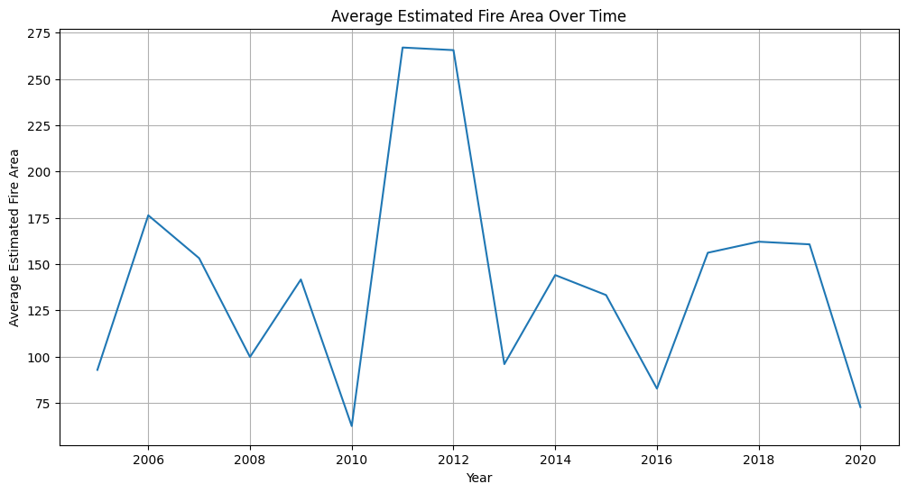
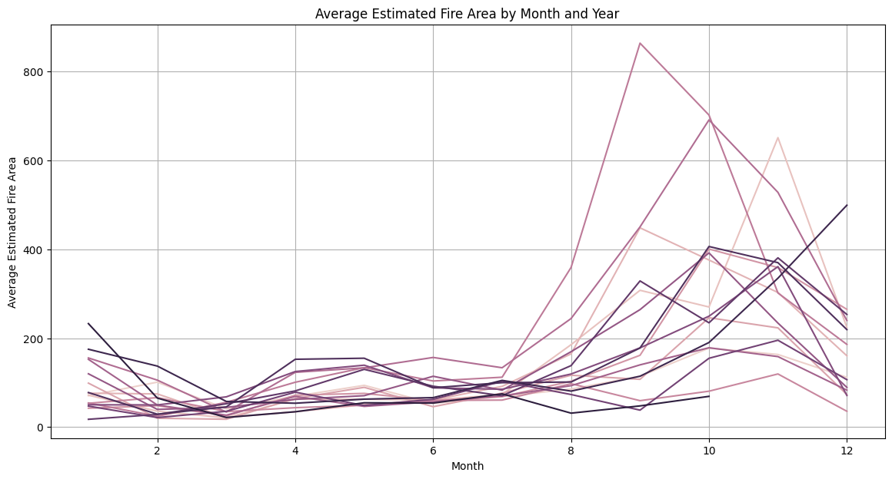
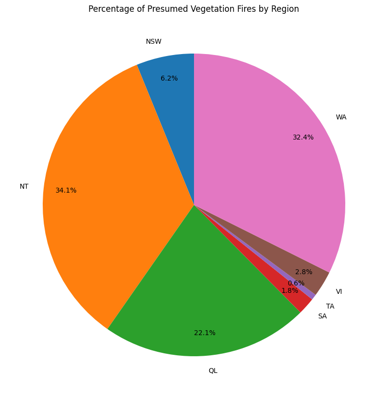
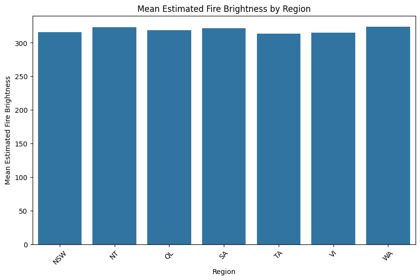
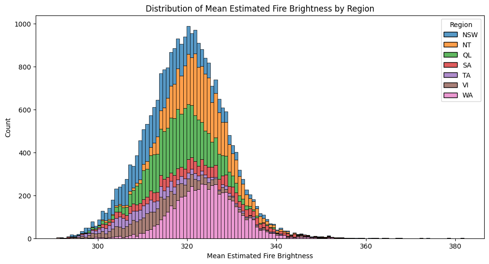
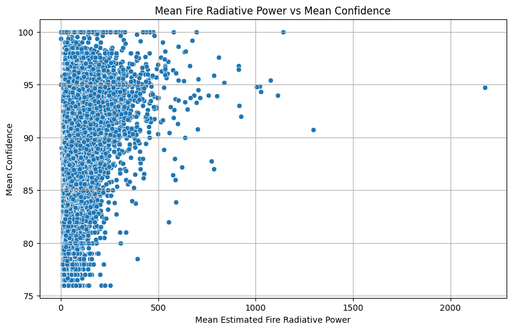
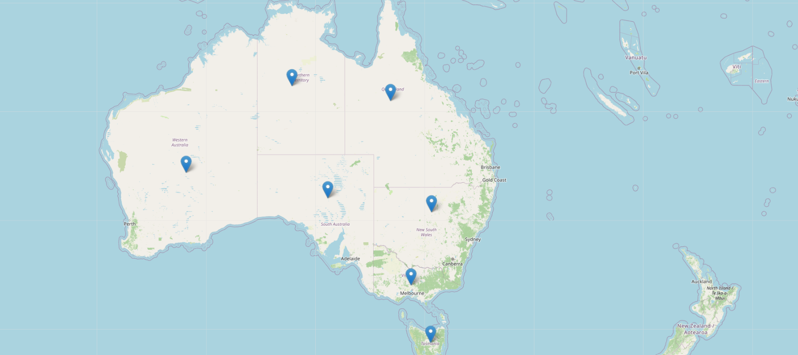

# australian-wildfire-data-analysis
## 📊 Key Insights & Visual Analysis

### 🔥 Fire Activity Trends Over Time

Wildfire activity fluctuates significantly year over year, with noticeable spikes indicating periods of intensified fire activity.

---

### 📅 Seasonal Patterns in Wildfires

Wildfires show strong seasonal behavior, with certain months consistently experiencing higher fire activity.

---

### 🌍 Regional Fire Distribution

A large proportion of wildfire activity is concentrated in key regions such as Northern Territory (NT), Western Australia (WA), and Queensland (QL).

---

### 💡 Fire Brightness by Region

Fire intensity remains relatively consistent across regions, suggesting similar fire behavior once ignition occurs.

---

### 📉 Distribution of Fire Brightness

Most wildfire events fall within a consistent brightness range, with fewer extreme outliers.

---

### 🔗 Radiative Power vs Confidence

Confidence levels remain high across a wide range of fire intensities, indicating multiple factors influence detection reliability.

---

### 📍 Geographic Mapping of Wildfire Regions

Mapping wildfire regions provides spatial context and highlights how fire activity is distributed across Australia.

---

## 🌍 Business / Real-World Impact

Wildfire data analysis supports real-world decision-making across multiple industries.

---

### 🔥 Emergency Response & Disaster Management

- Identify high-risk regions (NT, WA, QL) for resource prioritization  
- Plan seasonal staffing and emergency readiness  
- Improve response times during peak wildfire periods  

---

### 🌱 Environmental & Climate Monitoring

- Track long-term wildfire trends linked to climate change  
- Support ecosystem and biodiversity risk assessments  
- Monitor land degradation over time  

---

### 🏢 Insurance & Financial Risk Modeling

- Inform risk scoring for property insurance  
- Support premium pricing and underwriting decisions  
- Enable loss prediction and portfolio risk analysis  

---

### 🏙️ Urban Planning & Infrastructure

- Guide land use planning in fire-prone regions  
- Support fire-resistant infrastructure strategies  
- Improve evacuation planning and safety design  

---

### 📡 AI & Satellite Monitoring Systems

- Improve wildfire detection models using radiative power insights  
- Enhance AI-based fire classification accuracy  
- Support automated monitoring systems  

---

### 🎯 Why This Matters

This project demonstrates how data visualization translates into:

- Risk reduction  
- Resource optimization  
- Data-driven policy decisions  
